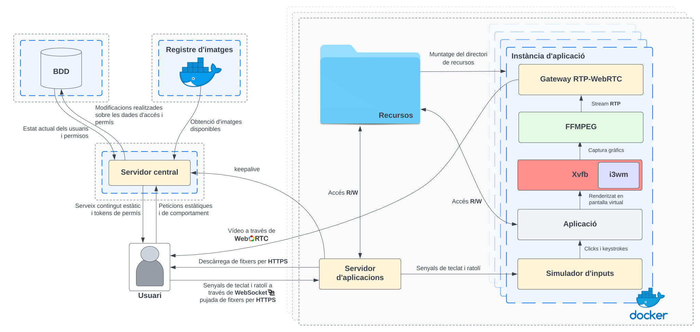

# Virtualitzador d'Aplicacions amb accés via web
El principal propòsit d'aquest projecte és el desenvolupament d'un servei i aplicació web que permeti accedir, a través d'un navegador, a aplicacions natives executant-se en màquines remotes on d'aquesta manera, els usuaris finals puguin fer servir aquestes aplicacions sense haver d'instal·lar-les en els seus dispositius, alliberant-los de requisits específics de *hardware*, S.O. o qualsevol altre *software* addicional més enllà d'un navegador. L'aplicació, a més, permetrà ser configurada per un usuari administrador, el qual podrà afegir noves aplicacions i limitar i controlar l'accés a aquestes.
El sistema garantirà la integritat i confidencialitat de les dades dels usuaris i proporcionarà aïllament entre les execucions simultànies d'aplicacions de diversos usuaris.

Per a aconseguir-ho, el servei ens permet executar aplicacions d'escriptori dins de **contenidors de Docker** aïllats i retransmetre'n el flux de vídeo a través de la web de forma nativa sense la necessitat d'instal·lar cap plug-in al navegador, permetent d'aquesta manera l'execució d'aplicacions al *cloud*.

## Demo

  

## Arquitectura general del sistema

  

## Instal·lació

Accedeix al [manual d'instal·lació del servei](/install)

## Autor

Aquest projecte ha estat dissenyat i desenvolupat per `Aniol Fernàndez Cano` com a projecte de fi de grau d'Enginyeria Informàtica a la Universitat de Girona.